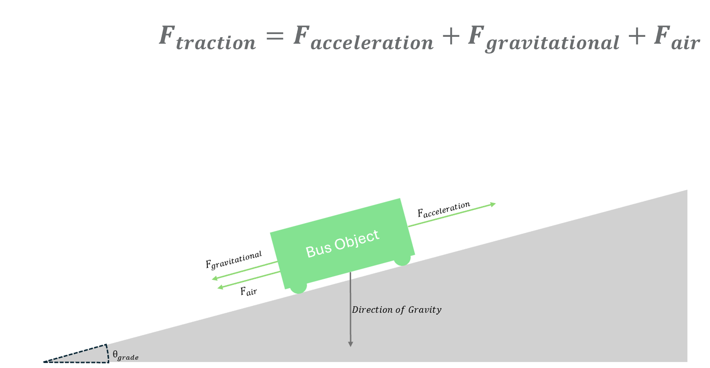
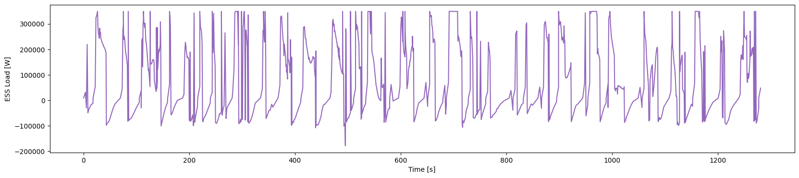
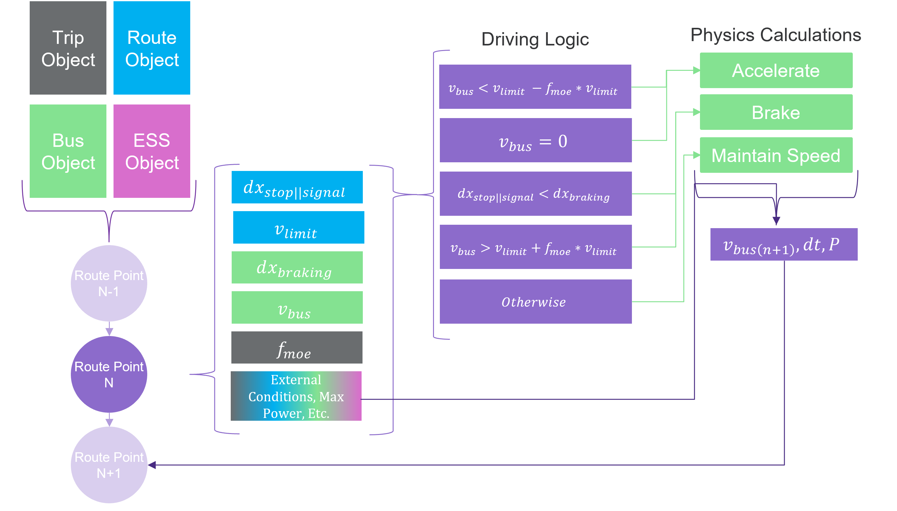

# Summary

The field of public transportation is steadily comitting to fully-electric vehicles in efforts to promote environmental sustainability. As a part of this process, transit agencies have typically performed pilot programs to better understand the potential benefits and shortfalls of electrification in their specific case. This can often be cost- and time- prohibitive. Rather than rely solely on these programs, it is possible to gather insights into the efficacy of these routes through the use of readily-available geospatial data and physics-based modeling.

The reRoute_Dynamics Package is a suite of highly adaptable tools that can be used to generate data-driven models of transit routes, vehicles, and their drive cycles. Through its use, users are able to create Longitudinal Dynamic Models that can allow for specific insights into not only a vehicle's energy use, but its pack use behavior as well. Ultimately, this opens up the avenue for high-throughput insights into route optimization, and even the dis-aggregation of use-specific battery ageing modes. 

# Background of Vehicle Energy Modeling
The EPA is responsible for laying out the standard for testing the milage of modern electric vehicles[@epa_range_testing]. This standard procedure has the vehicle run on a dynamometer following one of several standard drive cycles. The resulting milage is reduced by a factor of .7 to account for variability in less controllable factors like driving conditions, driver behavior, and HVAC use. This one-size-fits-all approach has been used by many previous transit researchers to help determine the aspects of transit that most influence energy consumption.

 
*Figure n*: Diagram of a Longitudinal Dynamics Model.

Longitudinal Dynamic Models have been a well-established method of determining the energy use of large transit vehicles based on simple rigid-body physics and standard equations of motion. Previous work {[@abdelaty],[@Asamer_Et_Al],[@thesis]} has demonstrated this model framework to be effective at modeling bus energy using simulink and python, as well as determining which aspects of a model influence the energy consumption the most. However, since they have also been reliant on standard drive cycles or manually collected drive cycles, they may not encompass the full variability inherent to driving. 

- What are the pros and cons of LDMs? What are the pros and cons of previous approaches?

# Statement of Need
 With frequent stops, sufficiently dynamic mass, and highly variable traffic and road conditions depending on geographic location, a standard drive cycle based solely on velocity has enough
 uncertainty it's worth taking a closer look at alternative methods. 

Rather than relying on a velocity profile aquired through tracking a vehicle's behavior or manually constructing one to test certain aspects of a vehicle, reRoute_Dynamics allows for the automated generation of a drive cycle. Through coupling an LDM with geospatial data like elevation, path, stops, and signals, it can quickly generate tailored drive cycles alongside the energy consumption behaviors. The high customizability of parameters range from speed-governed acceleration behavior [@XDE35_Manual], to geographical projection, to drivetrain and ESS efficiencies. This large number of parameter and modeling options enables analysis methods such as Monte Carlo simulations to get a better understanding of the range of conditions the energy storage system may face. 

 
*Figure n+1*: Selected values of a Monte Carlo Simulation performed on King County Metro Route 45 Outbound.

While any one model created using this toolkit may not be able to encompass all of the intricate detail and variability of a bus's drive cycle, it can be used for rapid and reasonable estimation of a proposed route's requirements. This information can extend into estimated maintenance and charging downtime, and is modular enough that it can be used to suit all sorts of transit needs. For example, King County Metro in Washington have begun piloting fully electric busses, so a tool like this could be of particular use to them and other transit agencies in how they approach their operations planning. 

 
*Figure n+2*: Example ESS Load Profile of King County Metro Route 45. 

Likewise, for those developing electric vehicle technology and energy storage systems, it enables the ability to create realistic load cycles. These cycles can be used in the research of EV battery failure modes and help dis-aggregate the aging inherent to the Energy Storage System from the aging due to use conditions. 

# Description

reRoute_Dynamics has several modules, each used for handling different aspects of generating a drive cycle. Many of these have more in-depth tutorials contained within the repository, but to simplify it down:

### Geography_Tools.py 
Geography_Tools.py is used to handle geospatial data and format it such that it can be used by the other modules. This includes methods for getting the bearings between two points, the coordinates bounding a geospatial dataset, geographical point interpolation, and reading raster elevation. The pinnacle of this is the Route class, which is used to contain the information for a given 'route' - its geometry, elevation, speed limits, transit stops, signal lights, and signs, as well as ways to save and load these in a dense .json format. 

### Object_Params.py 
Object_Params.py contains the basic object classes such as a bus, ESS, or trip. These classes are used to contain parameters for use in the modeling. Values like a bus' mass and frontal area, or a trip's expected ridership or wind bearing are all contained here, and can be saved or loaded for re-use. When saved, these objects are stored in an easily editable text file, which can likewise be re-loaded using methods within Object_Params. As part of this, there is also a method for generating an 'acceleration profile'. While possible to model a bus according to a single set acceleration, many metro busses such as the XDE35 use governers and other systems to control the manner in which they accelerate [@XDE35_Manual]. So, the user is capable of providing their own custom profile, or generating one that behaves in a similar manner to the acceleration seen in the Braunschweig Drive Cycle [@NREL_Drive_Cycle], here. 

### Physics_Engine.py 
Physics_Engine.py handles the primary physics calculations of a route through a Longitudinal Dynamic Model (LDM), including braking, accelerating, and maintaining speed. Critical to the model's response to external conditions is first how those conditions are calculated. As seen in Figure 3, a LDM is essentially a force balance. So, at any given point, the vehicle will be experiencing the external forces of wind ($F_w$) and road resistance ($F_r$), calculated as follows:
$$F_w = \frac{C_d *A_f*\rho}{2} *(v - v_w*\cos(\theta_{rw}))^2$$
$$F_r = (\sin(\theta_g) + \cos(\theta_g)*C_f) * g * m $$
Where $C_d$ and $C_f$ are the coefficients of vehcile drag and road friction, $A_f$ is frontal area, $\rho$ is air density, $v$ and $v_w$ are vehicle and wind speeds, and $\theta_{rw}$ and $\theta_{g}$ are relative wind angle and road grade angle (in radians). $g$ and $m$ are gravity and current vehicle mass. These are used to determine the acceleration the bus is experiencing at each point due to the environment, after dividing each by the total current mass of the vehicle.

The vehicle will also be experiencing 'internal acceleration', which is determined by wether the bus is braking, accelerating, or maintaining speed. When braking, the bus's decelelleration is calculated according to the following formula:

$$ a_{int} = (a_{br} * f_i * f_{br})$$

where $a_{br}$ is the maximum braking acceleration, $f_i$ is the inertial factor - the amount the bus's mass reduces the braking ability - and $f_{br}$ is the braking factor, how hard the driver is hitting the pedal. 

When maintaining speed, $a_{int}$ is set to match the current external acceleration of $\frac{F_w + F_r}{m}$, where possible. If this value exceeds what would otherwise be possible with the braking power of the bus, $P_{br-max} = -m*v*(a_{br}*f_i)$, or the motor power of the bus, the velocity is adjusted by using iterations of the standard kinematic equations. 

Acceleration is the most complicated of the three, given it is meant to adhere to a given velocity profile. By assuming the acceleration profile is operated via a speed governer, the profile is integrated and the closest velocity to the vehicle is used as the starting point. The profile is then stepped through, accelerating the vehicle by the requisite amount, so long as the motor power limit is not exceeded. If that power limit is hit, the bus's net internal acceleration will be zero. 

Each calculation performed will return a final velocity, a time change for that action, and a power use for that action. Depending on the operation, these will be calculated slightly differently - but generally, Power is calculated using $m*a*v$, where $a$ is the internal acceleration of the bus, prior to losses from the envoronment, $m$ is vehicle mass, and $v$ is vehicle velocity. 

### Trip_Simulator.py 
Trip_Simulator.py is used to put all three of the above together and run a given Bus with an ESS for a trip along a defined route. This can act both as a standalone script, or a module. Containing a single method, it combines a route that was generated using Geography_Tools.py, and a Bus, ESS, and Trip, and passes each point contained in the route through a system of logic bsaed on the conditions defined.  

*Figure n+3*: Flow diagram of the simulation process. 

This set of logic is used to determine which operation in the physics engine is used, which in turn informs the next point on the route.  

# Future Work

This toolkit has been shown to make reasonable models of realistic bus driving cycles, and is capable of producing simulations that can provide insights into the variability in ESS load for a given route. While the accuracy and implications of these simulations are more pertinent to be adressed on their own, the toolkit is set up in such a way that its modularity allows for significantly more customization and fidelity - a model is only as good as the data provided to it. 

Future development should include better accounting for drivetrain mechanisms, more traffic and road condition effects, and improved ESS modeling. This could include things like an HVAC power use determined by speed and ambient temperature, or dynamic modeling of cells and module aging. Simulation of ridership changes and signal light timings are, at present, randomly generated according to values provided in the Trip object. To more accurately model individual routes in the future, these should be able to be provided by a user. Beyond this, the geography handling takes a not-insignificant amount of time, so the models produced are not reasonable for use in highly time-sensitive applications.

Nonetheless, this remains a powerful tool and scaffolding for further transit and energy research, and makes easier study and development of how different aspects of a route, a bus, and an ESS impact the effectiveness of a Battery Electric Vehicle. 

# Acknowledgements

This project was originally based off of the "Route Dynamics" Package created by Dr. Erica Eggleton, so a special thanks to her for the original concepts and groundwork. 
Thank you to Dr. Daniel T. Schwartz, for advising me during the course of developing this, and to Dr. Dave Beck, whom helped advise me and laid the foundation for many of the skills used in the creation of this. 

# References